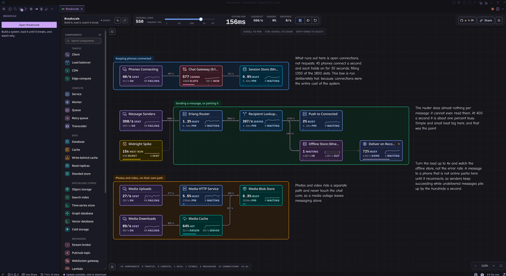

# Breakscale for VS Code

Breakscale is a system design simulator for learning how distributed systems behave under load.
Place components on a canvas, wire them together, then drag a slider and watch real queueing
behaviour emerge: latency percentiles climbing, queues filling, circuit breakers tripping, whole
systems collapsing into retry storms.

Every number comes from an actual discrete-event simulation. Nothing is faked, approximated, or
animated to look plausible.

This extension runs the whole simulator in an editor panel, so the thing you reach for while
thinking about an architecture is in the same window as the code you are thinking about.

## Using it

Open the command palette and run **Open Breakscale**. The panel opens beside your editor and
behaves exactly like the web app: 33 components, 23 worked examples, chaos controls, and the same
engine underneath.

Everything runs locally. The simulation needs no network, and nothing about your designs is sent
anywhere.

## What is in it

**33 components.** Load balancers, caches, databases, queues and workers, plus CDNs, rate
limiters, circuit breakers, read replicas, sharded stores, autoscalers, stream brokers, WebSocket
gateways, serverless functions and bulkheads.

**23 worked examples.** Sixteen teaching scenarios and seven reconstructions of real
architectures, each one loadable in a click.

**Chaos controls.** Crash a node, slow it down, force an error rate, or cut a single link, then
watch the failure propagate.

**Explanations built in.** Every metric and unit has a plain-language definition, because a number
a student cannot act on is trivia.

## Designs you save

Saved designs live in VS Code's own storage, so they survive closing the panel and restarting the
editor. They are separate from anything saved on [breakscale.tech](https://breakscale.tech): the
two do not sync, and a design saved in one will not appear in the other.

To move a design between them, use the share link or the file export.

## Links

- [breakscale.tech](https://breakscale.tech) runs the same simulator in a browser
- [Documentation](https://docs.breakscale.tech)
- [Source and issues](https://github.com/xevrion/breakscale)

MIT licensed. The bundled Caveat webfont is licensed separately under the SIL Open Font License
1.1.
